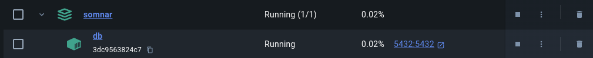

<h1 style="text-align: center">
somnAR
</h1>

<h3 style="text-align: center">
Analysis and Forescasting of Health-Related Time Series Data using ARIMA, Holt Winters and LSTM
</h3>

## 😴 What's somnAR? 
The goal of this project is to analyze and forecast health-related time series data using classical time series models such as **ARIMA** and **Holt Winters**, as well as deep learning techniques such as **Long Short-Term Memory** (LSTM) neural networks. The project will involve working with a personal dataset of health-related time series data, including sleep patterns, physical activity levels, and other health metrics.

&nbsp;

The name **somnar** is a wordplay combining **somnia** (Latin for "dreams") and **ar** (short for "auto-regressive"). Moreover, **somnar** is the present tense of the Swedish verb **somna**, which means "to fall asleep". 😃

## Objectives


* To develop and apply ARIMA and Holt Winters models to analyze and forecast health-related time series data.

* To develop and apply LSTM neural networks to analyze and forecast health-related time series data.

* To compare the performance of classical time series models and deep learning techniques in terms of accuracy and interpretability.

* To explore the datasets and identify patterns and trends in the health-related time series data.

&nbsp;

#### TODO LIST

| Tool          | Status |
|---------------|:------:|
| Database      |   🚧   |
| EDA           |        |
| Visualization |        |
| ARIMA         |        |
| LSTM          |        |
| UI            |        |

## PostgreSQL Docker Database config

Run the command docker-compose in the main directory of the application. You need to have Docker and Docker Compose installed previously.

```bash
docker-compose up -d
```

&nbsp;

The Docker configuration will create a container for the database and execute the automatically file creation tables **init.sql**, located in the data directory.
The service will listen on port **5432**.

It is necessary to input the data into the data directory, as the CSV files will be directly copied into the PostgreSQL tables.

&nbsp;

